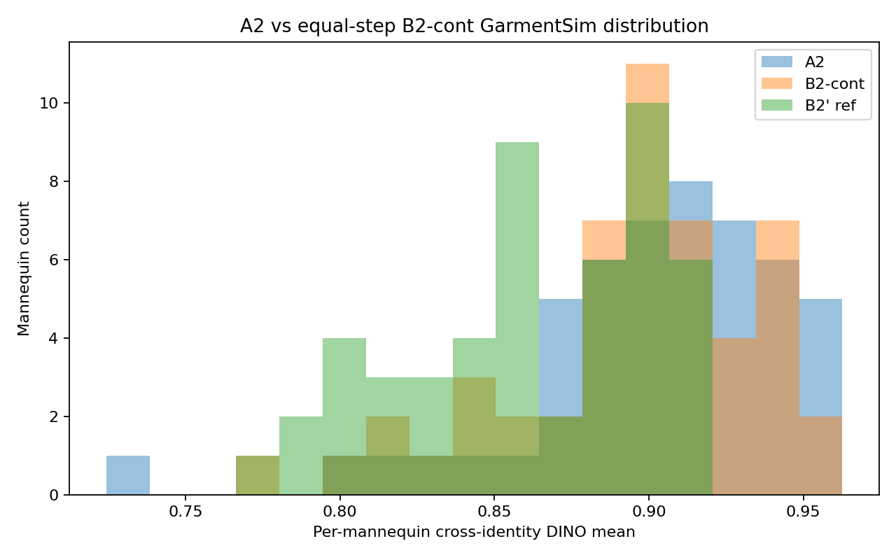

# A2 Differential Gate Result

Completed on 2026-07-16 using code commit `f872855`.

The decision comparison is A2 differential continuation versus the equal-step
B2-cont paired-only continuation. Both runs resumed the same B2-prime
checkpoint and used the same ordered train IDs, sampler state, seed, global
batch, learning rate, LoRA rank, and 4000 continuation steps.

## Verdict

**FAIL: the differential branch did not clear the predefined mechanism gate.**

| Metric | A2 | B2-cont | Difference |
|---|---:|---:|---:|
| DeltaID mean | 0.4201 | 0.4088 | +0.0113 |
| Held-out target similarity | 0.4388 | 0.4223 | +0.0165 |
| GarmentSim per-mid mean | 0.9016 | 0.8951 | +0.0065 |
| GarmentSim bottom-quartile mean | 0.8469 | 0.8406 | +0.0063 |
| Pose cross-ID mean-axis variance | 89.0563 | 90.5637 | -1.5074 |

GarmentSim improvement was not significant
(`p=0.06648`) and the bottom-quartile improvement did not reach the required
`0.02`. Identity did not regress. Pose variance showed a favorable but
non-significant trend (`p=0.05369`).

## Files

- `gate_report.md`: final fairness check, paired tests, and automatic verdict.
- `gate_report.json`: machine-readable gate result.
- `a2_report.md`: A2 held-out identity, garment, and head-pose metrics.
- `b2cont_report.md`: equal-step paired-only control metrics.

The reports retain absolute local artifact paths as provenance. Generated
images, per-image CSV files, checkpoints, model weights, and datasets are not
tracked in Git.
